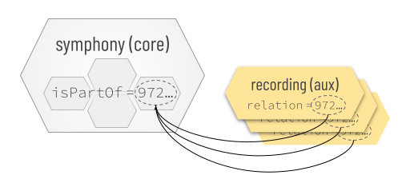

# Cross-File Associations

Cross-File Associations (CFAs) are conventions that reveal and preserve connections among files and file-like objects. They can be used to make software and humans smarter about grouping things together.

CFAs are simple enough that a human can learn them in a couple minutes, but robust enough to provide a foundation for sophisticated software.

Consider an email that includes as attachments a slide deck, photos, a spreadsheet, and a digital signature. A CFA can make it obvious that the digital signature is bound to the spreadsheet. Noticing the CFA, email client can encourage uploading or downloading the two associated files as a unit, and warn if they become separated.

## Basic Concepts

The theory behind CFAs is described in an academic paper, and the specification for CFAs is published as an RFC. We'll skip most of the details in this tutorial, but we still need to define a few terms.

In the context of CFAs, a __file__ is anything that has a name/identifier and content -- the familiar artifact in a file system, but also a web page, a tweet, a piece of data, etc. A __container__ is anything that holds files: a folder, an email, a zip file, a database, an S3 bucket, and so forth.

When a file is party to a CFA, we say that the file __binds__ the CFA. A given file may bind zero or more CFAs.

CFAs can be either __directional__ or __directionless__.

A directional CFA confers special status on a subset of its bound files that are *first* (possibly, meaning more important, but certainly meaning that they should exist before the rest of the set can be populated). These are known as __core files__. Other files are dependent on this core; they cannot be created until the core exists, and they typically lose meaning if the core is missing. These are __aux files__.

A directionless CFA lacks this dependency construct; it models a simple set in which all bound files are peer, aux files.

There are different ways to declare a CFA. We call them __strategies__. Different strategies have different pros and cons.

When the strategy that binds a file to a CFA requires changes to the content of the file, we say that the strategy is __internal__, or that the file is __internally bound__. When the binding convention manifests outside the content of the file, we say that the strategy is __external__, or that the file is __externally bound__. External and internal strategies are not mutually exclusive.

## Strategies

Currently, five strategies for declaring a CFA are standardized.

### Sidecar

One strategy is to name files in a way that embodies the __sidecar__ naming pattern. In this strategy, there is one core file in the CFA, and it has any arbitrary name. Aux files are called "sidecars" because their names are dependent on the core: a sidecar name equals the name of the core file followed by a unique, descriptive suffix.

Returning to the spreadsheet-digital-signature-in-email example that we mentioned above, if the spreadsheet attachment is named `balance-sheet.xlsx`, and the digital signature attachment is named `balance-sheet.xlsx.sig`, an email client can know that a sidecar CFA is active; the spreadsheet is the core file, and the digital signature is aux.

Sidecar CFAs are not always pairwise. We could add a third file in the same container and name it `balance-sheet.xlsx-audit-report.docx`; this would be an additional sidecar bound to the same CFA.

In sidecar names, the boundary between the core name and the unique sidecar suffix must be delimited by a non-word character such as a space, `.`, `-`, or `_`.

Sidecar CFAs are directional and external. Like all external strategies, they are also container-dependent; the relationship implied by the naming convention cannot be evaluated except within the context of a shared container.

Sidecar naming is easy and intuitive; in fact, it is already used as described here by many individuals and software packages that are making CFAs without instruction. However, it's not as powerful as some other strategies.

### Shared Stem

A variation on sidecars is to associate files by giving their name a common __stem__, varying only in the extension portion. The stem of a filename is the portion before the first `.` character. Digital cameras and related software often uses this strategy &mdash; saving `.raw` + `.tiff`, or `.heic` + `.jpg` versions of each photo as associated pairs.

Although shared stems resemble sidecars in some ways, their semantics are different. Shared stems are directionless; within the files that share a stem, there is no notion of dependency. This makes them an awkward fit for the spreadsheet-digital-signature-in-email example we used above. Naming the spreadsheet `balance-sheet.xlsx` and the signature `balance-sheet.sig` *does* connect them, but it does not convey the idea that the signature is meaningless without the spreadsheet.

Like sidecars, shared stems are easy and intuitive, but their expressiveness is limited.

### Infix

Another simple CFA convention is the __infix__ pattern. In this pattern, files that bind the same CFA share a common 1-to-3-digit infix in their names. The infix cannot begin a name. It must be preceded by two hyphens and followed by a non-word character.

Suppose a police photographer is documenting an accident that involved several vehicles, and each will be photographed from multiple angles and lighting conditions. They might associate photos for vehicle 1 using a common infix: `front-bumper--01.jpg` and `drivers-door--01.jpg`, respectively.

Infixes are compared numerically, not textually; this means an infix of `01` and an infix of `1` are equivalent.

A file may bind more than one infix in its name: `tangled-bumpers--1--3.jpg` is a member of groups using both the `1` and `3` infixes, and might show both vehicles 1 and 3 in our example.

Normally, infixes are directionless; however, advanced options can change this.

### Metadata

Files that have formats capable of formally declaring metadata may embed CFAs using whatever syntax their format allows. Because the CFA information is inside the file, this is an internal strategy.

The location and syntax for declaring metadata varies by file format, so this strategy has various permutations. However, the principles are always the same. We'll describe the principles, and then explain how those principles manifest in various formats.

Metadata-based CFA declarations are essentially `name=value` pairs. The `name` part tells what CFA semantics are intended, and the `value` part provides an arbitrary identifier that makes the CFA declaration unique. In other words, each `name=value` metadata annotation coveys the idea, "This file binds a CFA of type `name`, and the identifier for this particular CFA is `value`." Files that share a CFA annotation with the same identifier in the `value` portion of one of these annotations bind the same CFA and are thus part of the same set.

Importantly, files bound to a CFA in this way can be part of the same set whether or not they are in the same container, and whether or not they are owned or controlled by the same party. This can solve certain problems that require decentralization. 

Suppose a composer of classical music wants to mark all her compositions as belonging to the overall corpus of compositions that she creates during her career. She can embed metadata in each new digital file that she authors, marking it internally as part of a CFA identified by the UUID `0bbfac55-81c9-48ab-8934-9a46c64c0703`. That UUID then binds all her creative output together, even if it's built with a variety of tools, for many clients, across decades, and stored in a hodge-podge of storage containers.

When creating CFA metadata annotations, three variants of the `name` half of the pair are defined. The names of these variants come from the [Dublin Core standard for metadata](https://www.dublincore.org/specifications/dublin-core/dcmi-terms/), and the associated semantics match what is defined there.

* [identifier](https://www.dublincore.org/specifications/dublin-core/dcmi-terms/#http://purl.org/dc/terms/identifier): A file that carries this type of CFA annotation declares itself to be the one and only core file in the CFA. Thus, the identifier in the `value` half of the pair can be used as a one-to-one lookup key for the file. All other files in the same CFA must be aux files (see the "relation" variant next).

* [relation](https://www.dublincore.org/specifications/dublin-core/dcmi-terms/#http://purl.org/dc/terms/relation): A file that carries this type of CFA annotation declares itself to be dependent upon a CFA core that's associated with the identifier in the `value` half of the metadata pair. Thus, it is what CFA considers an aux file.

* [isPartOf](https://www.dublincore.org/specifications/dublin-core/dcmi-terms/#http://purl.org/dc/terms/isPartOf): A file that carries this type of CFA annotation declares itself to be part of a multi-file core.

To understand how these annotations might be used, consider a case where the composer writes a piece of music for the violin. Later, she arranges a derivative version for the clarinet. The clarinet version is aux &mdash; dependent upon the original violin composition &mdash; which is core. In such a case, and assuming the composer chooses arbitrary identifier `68d15148-a0bd-4716-9618-061a17389689` for the CFA, she would embed metadata in her core violin composition that says:

    identifier = 68d15148-a0bd-4716-9618-061a17389689

And she would embed metadata in her aux clarinet arrangement that says:

    relation = 68d15148-a0bd-4716-9618-061a17389689

The metadata expresses a directional CFA.

Now suppose that the composer writes a symphony that has 4 movements. Each movement is a separate digital file emitted by her composition software. She wants them to be associated with the arbitrary identifier `972d639a-04d7-4c1e-9ea9-196e94b05eb0` to bind her symphony together, so she embeds metadata in each movement's digital file. The metadata says:

    isPartOf = 972d639a-04d7-4c1e-9ea9-196e94b05eb0

The metadata in this situation also expresses a directional CFA, but all the files we've talked about so far are core. However, the possibility of aux is still useful. If three recordings of this symphony are performed, the composer can mark the recordings as aux, dependent on the composite core: 

### Clarifiers

__Clarifiers__ are optional, supplemental annotations that let a content creator specify the *cardinality* of a set, and characterize the nature of a dependency. They can change a CFA from saying "This file is core and may have aux files" to "This file is core and has exactly one aux file that is a digital signature over the core."

In external strategies, clarifiers manifest as an additional infix in a filename. In internal strategies, they are an extra token appended to the `value` portion of a `name=value` metadata pair.

A clarifier is a three-part string. The first and third parts are cardinality numbers that quantify how many core and aux files, respectively, are known to be part of the set. For a CFA binding a spreadsheet to a digital signature, both of these numbers would be 1 &mdash; it's a 1-to-1 relationship. For a CFA binding the 4 movements of a symphony, the first number would be 4, since all 4 movements are core. If cardinality is not known, the number is omitted. A cardinality of 0 means that no files in the set have the corresponding status. 

The middle part of a clarifier is a __dependency predicate symbol__. The following symbols are defined:

symbol | meaning                                               | sample use cases
--- |-------------------------------------------------------| ---
c | aux <u>c</u>ites core                                 | An academic paper (core) and a subsequent paper that quotes from it (aux). An affidavit (core) and a legal filing that references it (aux).
d | aux <u>d</u>erives from core                          | A violin concerto (core) that spawns an arrangement for clarinet (aux). A novel (core) and its audiobook version (aux). A repo of source code (core) and its forks (aux).
f | aux <u>f</u>ollows (answers, replies to) core         | A tweet (core) and a reply (aux). A critique (core) and a rebuttal (aux). An email (core) and a response (aux).
r | aux <u>r</u>eviews core                               | A financial statement (core) and an auditor's report (aux). An album (core) and a review by a music critic (aux).
s | aux <u>s</u>upersedes core                            | Version 1 of a formal standard (core) and version 2 (aux).
t | aux <u>t</u>ransforms core (typically in a lossy way) | A news article (core) and translations (aux). A vector graphic (core) and a bitmap graphic (aux). An audio stream (core) and a transcription (aux). A FLAC audio recording (core) and its .mp3 compression (aux). In general, transformations that are not lossy (e.g., a file in zipped and unzipped form, the same text encoded in UTF-16 and UTF-8) do not have an obvious core-to-aux directionality and are thus thought of as multi-core (not needing clarification).
v | aux <u>v</u>erifies core                              | A spreadsheet (core) and its digital signature (aux). A downloadable software package (core) and its hash (aux). A git commit (core) and its hash (aux). A piece of malware (core) and its distinctive profile/signature (aux). A credential presentation, including nonce (core) and its signature (aux).
x | default                                               | Generic/ill-defined dependency, or multiple aux files exist with different meanings. Separates the two cardinalities without asserting any special semantics.
