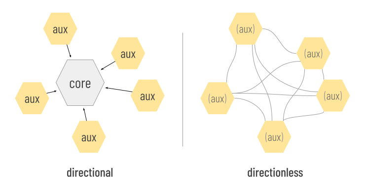

# Cross-File Associations

Cross-File Associations (CFAs) are conventions that reveal and preserve connections among files and file-like objects. They can be used to make software and humans smarter about grouping things together.

CFAs are simple enough that a human can learn them in a couple minutes, but robust enough to provide a foundation for sophisticated software.

Consider an email that includes as attachments a slide deck, photos, a spreadsheet, and a digital signature. A CFA can make it obvious that the digital signature is bound to the spreadsheet. Noticing the CFA, email client can encourage uploading or downloading the two associated files as a unit, and warn if they become separated.

## Basic Concepts

The theory behind CFAs is described in an academic paper, and the specification for CFAs is published as an RFC. We'll skip most of the details in this tutorial, but we still need to define a few terms.

In the context of CFAs, a __file__ is anything that has a name/identifier and content -- the familiar artifact in a file system, but also a web page, a tweet, a piece of data, etc. A __container__ is anything that holds files: a folder, an email, a zip file, a database, an S3 bucket, and so forth.

When a file is party to a CFA, we say that the file __binds__ the CFA. A given file may bind zero or more CFAs.

CFAs can be either __directional__ or __directionless__.

A directional CFA confers special status on a subset of its bound files that are *essential*. These are known as __core files__. Other files are dependent on this core; they lose meaning if the core is missing. These are __aux files__.

A directionless CFA lacks this dependency construct; it models a simple set in which all bound files are peer, aux files.

There are different ways to declare a CFA. We call them __strategies__. Different strategies have different pros and cons.

When the strategy that binds a file to a CFA requires changes to the content of the file, we say that the strategy is __internal__, or that the file is __internally bound__. When the binding convention manifests outside the content of the file, we say that the strategy is __external__, or that the file is __externally bound__. External and internal strategies are not mutually exclusive.

## Strategies

Currently, five strategies for declaring a CFA are standardized.

### Sidecar

One strategy is to name files in a way that embodies the __sidecar__ naming pattern. In this strategy, there is one core file in the CFA, and it has any arbitrary name. Aux files are called "sidecars" because their names are dependent on the core: a sidecar name equals the name of the core file followed by a unique, descriptive suffix.

Returning to the spreadsheet-digital-signature-in-email example that we mentioned above, if the spreadsheet attachment is named `balance-sheet.xlsx`, and the digital signature attachment is named `balance-sheet.xlsx.sig`, an email client can know that a sidecar CFA is active; the spreadsheet is the core file, and the digital signature is aux.

Sidecar CFAs are not always pairwise. We could add a third file in the same container and name it `balance-sheet.xlsx-audit-report.docx`; this would be an additional sidecar bound to the same CFA.

In sidecar names, the boundary between the core name and the unique sidecar suffix must be delimited by a non-word character such as a space, `.`, `-`, or `_`.

Sidecar CFAs are directional and external. Like all external strategies, they are also container-dependent; the relationship implied by the naming convention cannot be evaluated except within the context of a shared container.

Sidecar naming is easy and intuitive; in fact, it is already used as described here by many individuals and software packages that are making CFAs without instruction. However, it's not as powerful as some other strategies.

### Shared Stem

A variation on sidecars is to associate files by giving their name a common __stem__, varying only in the extension portion. The stem of a filename is the portion before the first `.` character. Digital cameras and related software often uses this strategy &mdash; saving `.raw` + `.tiff`, or `.heic` + `.jpg` versions of each photo as associated pairs.

Although shared stems resemble sidecars in some ways, their semantics are different. Shared stems are directionless; within the files that share a stem, there is no notion of dependency. This makes them an awkward fit for the spreadsheet-digital-signature-in-email we used above. Naming the spreadsheet `balance-sheet.xlsx` and the signature `balance-sheet.sig` does connect them, but it loses the notion that the signature is meaningless without the spreadsheet.

Like sidecars, shared stems are easy and intuitive, but their expressiveness is constrained.

### Infix

Another simple CFA convention is the __infix__ pattern. In this pattern, files that bind the same CFA share a common 1- or 2-digit infix in their names. The infix cannot begin a name. It must be preceded by two hyphens and followed by a non-word character.

Suppose a police photographer wants to document an accident involving several vehicles, and each will be photographed from multiple angles and lighting conditions. She might bind photos for vehicle 1 using a common infix: `front-bumper--01.jpg` and `drivers-door--01.jpg`, respectively.

Infixes are compared numerically, not textually; this means an infix of `01` and an infix of `1` are equivalent. Normally, infixes are directionless; however, there are advanced options that can change this.

A file may bind more than one infix in its name: `tangled-bumpers--01--04.jpg` is a member of groups using both the `01` and `04` infixes, and might show parts of vehicles 1 and 4 in our example.

### Metadata

Files with formats that can hold metadata may declare CFAs using whatever metadata features their format allows. This is an internal strategy.

Metadata-based CFA declarations are essentially `name=value` pairs. The `name` part tells which kind of CFA is intended, and the `value` part provides an identifier that makes the CFA declaration unique.

All files that share a CFA annotation with the same identifier are part of the same set (that is, they *bind* the same CFA). For example, a photographer could embed metadata in a dozen photos, marking all of them as part of a CFA identified by the string `0bbfac55-81c9-48ab-8934-9a46c64c0703`. This would logically group the photos together, even if they are in different containers.

The `name` component of a CFA metadata annotation tells what type of CFA semantics are intended. Three types of `name` are possible:

* __identifier__: A file that carries this type of CFA annotation declares itself to be the one and only core file in the CFA.

* __partOf__: A file that carries this type of CFA annotation declares itself to be the one and only core file in the CFA.

* __relation__: A file that carries this type of CFA annotation declares itself to be the one and only core file in the CFA.