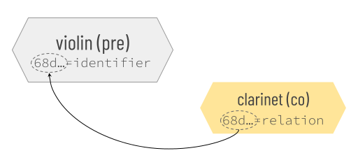

# Cross-File Associations

Cross-File Associations (CFAs) are conventions that reveal and preserve connections among files and file-like objects. They make software and humans smarter about grouping things together.

CFAs aren't for expressing every nuance of relationships; rather, they make it easy to say the basics. They aim for a sweet spot: simple enough for anybody to use without special tools &mdash; but sophisticated enough to enable powerful features in software that wants to be helpful.

Consider an email that includes as attachments a slide deck, photos, a spreadsheet, and a digital signature. A CFA can make it obvious that the digital signature is bound to the spreadsheet. Noticing the CFA, email clients can encourage uploading or downloading the two associated files as a unit, and warn if they become separated.

## Quick Reference

## Tutorial

### Concepts

The theory behind CFAs is described in [an academic paper](https://example.com), and the [specification for CFAs](https://github.com/dhh1128/cfa-rfc) is published as an RFC. We'll skip most of the details in this tutorial, but we still need to define a few terms.

In the context of CFAs, a __file__ is anything that has a name/identifier and content &mdash; the familiar artifact in a file system, but also a web page, a tweet, a piece of data, etc. A __container__ is anything that holds files: a folder, an email, a zip file, a database, an S3 bucket, and so forth.

When a file participates in a cross-file association, we say that the file __binds__ the CFA. A given file may bind zero or more CFAs.

CFAs can be either __directed__ or __common__.

A directed CFA imputes special status to a subset of its bound files that *come before* the others. The precedence of these files may or may not mean they are more valuable &mdash; importance and utility are contextual &mdash; but such files are almost always created *first*, and they provide a *logical foundation* toward which the group is oriented and upon which the meaning of the overall group depends. Such files are called __pre files__.

Files that lack this special status in a CFA are called __co files__.

If the same audio recording is saved in both .flac and .mp3 format, the two files might be bound into a CFA that is directed toward the *pre* FLAC version (which is lossless), with the lossy MP3 as a *co* file.

A common CFA is not directed toward *pre*; it models a simple set in which all bound files are *co* files with one another.

A given file may have *pre* status in one CFA, and *co* status in another. 

There are different ways to declare a CFA. We call them __strategies__. Different strategies have different pros and cons.

When the strategy that binds a file to a CFA requires changes to the content of the file, we say that the strategy is __internal__, or that the file is __internally bound__ to that CFA. When the binding convention manifests outside the content of the file, we say that the strategy is __external__, or that the file is __externally bound__. External and internal strategies are not mutually exclusive; a given file may use both to bind CFAs.

## Strategies

Several strategies for declaring a CFA are currently standardized.

### Sidecar

One strategy is to name files in a way that embodies the __sidecar__ naming pattern. In this strategy, there is one pre file in the CFA, and it has any arbitrary name. Any co files are called "sidecars" because their names are dependent on the pre: a sidecar name equals the name of the pre file followed by a unique, descriptive suffix.

Referencing the spreadsheet-digital-signature-in-email example that we mentioned above, if the spreadsheet attachment is named `balance-sheet.xlsx`, and the digital signature attachment is named `balance-sheet.xlsx.sig`, an email client can know that a sidecar CFA is active; the spreadsheet is the pre file, and the digital signature is co.

Sidecar CFAs are not always pairwise. We could add a third file in the same container and name it `balance-sheet.xlsx-audit-report.docx`; this would be an additional sidecar bound to the same CFA.

In sidecar names, the boundary between the pre name and the unique sidecar suffix must be delimited by a non-word character such as a space, `.`, `-`, or `_`.

Sidecar CFAs are directional and external. Like all external strategies, they are also container-dependent; the relationship implied by the naming convention cannot be evaluated except within the context of a shared container.

Sidecar naming is easy and intuitive; in fact, it is already used as described here by many individuals and software packages that are making CFAs without instruction. However, it's not as powerful as some other strategies.

### Shared Stem

A variation on sidecars is to associate files by giving their name a common __stem__, varying only in the extension portion. The stem of a filename is the portion before the first `.` character. Digital cameras and related software often uses this strategy &mdash; saving `.raw` + `.tiff` or `.heic` + `.jpg` versions of each photo as associated pairs.

Although shared stems resemble sidecars in some ways, their semantics are different. Shared stems are directionless; within the files that share a stem, there is no notion of dependency. This makes them an awkward fit for the spreadsheet-digital-signature-in-email example we used above. Naming the spreadsheet `balance-sheet.xlsx` and the signature `balance-sheet.sig` *does* connect them, but it does not convey the idea that the signature is meaningless without the spreadsheet.

Like sidecars, shared stems are easy and intuitive, but their expressiveness is limited.

### Infix

Another simple CFA convention is the __infix__ pattern. In this pattern, files that bind the same CFA share a common 1-to-3-digit infix in their names. The infix cannot begin a name. It must be preceded by two hyphens and followed by a non-word character.

Suppose a police photographer is documenting an accident that involved several vehicles, and each will be photographed from multiple angles and lighting conditions. They might associate photos of vehicle 1 using a common infix: `front-bumper&mdash;01.jpg` and `drivers-door&mdash;01.jpg`, respectively.

Infixes are compared numerically, not textually; this means an infix of `01` and an infix of `1` are equivalent.

A file may bind more than one infix in its name: `tangled-bumpers&mdash;1&mdash;3.jpg` is a member of CFAs using both the `1` and `3` infixes, and might show both vehicles 1 and 3 in our example.

Normally, infixes are directionless; however, advanced options can change this.

### Metadata

Files that have formats capable of formally declaring metadata may embed CFAs using whatever syntax their format allows. Because the CFA information is inside the file, this is an internal strategy.

The location and syntax for declaring metadata varies by file format, so this strategy has various permutations. However, the principles are always the same. We'll describe the principles, and then explain how those principles manifest in various formats.

Metadata-based CFA declarations are essentially `name=value` pairs. The `name` part tells what CFA semantics are intended, and the `value` part provides an arbitrary identifier that makes the CFA declaration unique. In other words, each `name=value` metadata annotation coveys the idea, "This file binds a CFA of type `name`, and the identifier for this particular CFA is `value`." Files that share a CFA annotation with the same identifier in the `value` portion of one of these annotations bind the same CFA and are thus part of the same set.

Importantly, files bound to a CFA in this way can be part of the same set *whether or not they are in the same container, and whether or not they are owned or controlled by the same party*. This can solve certain problems that require decentralization. 

Suppose a composer of classical music wants to mark all her compositions as belonging to the overall corpus of compositions that she creates during her career. She can embed metadata in each new digital file that she authors, marking it internally as part of a CFA identified by the UUID `0bbfac55-81c9-48ab-8934-9a46c64c0703`. That UUID then binds all her creative output together, even if it's built with a variety of tools, for many clients, across decades, and stored in a hodge-podge of storage containers.

When creating CFA metadata annotations, three variants of the `name` half of the pair are defined. These correspond to three different perspectives on the CFA relationship. The perspectives come from the [Dublin pre standard for metadata](https://www.dublinpre.org/specifications/dublin-pre/dcmi-terms/), and the associated semantics match what is defined there.

* [identifier](https://www.dublinpre.org/specifications/dublin-pre/dcmi-terms/#http://purl.org/dc/terms/identifier): A file with this perspective on a CFA declares itself to be the one and only pre file in the CFA. Thus, the identifier in the `value` half of the pair can be used as a one-to-one lookup key for the file. All other files in the same CFA must be co files (see the "relation" variant next).

* [relation](https://www.dublinpre.org/specifications/dublin-pre/dcmi-terms/#http://purl.org/dc/terms/relation): A file with this perspective on a CFA declares itself to be dependent upon a CFA pre that's associated with the identifier in the `value` half of the metadata pair. Thus, it is what CFA considers a co file.

* [isPartOf](https://www.dublinpre.org/specifications/dublin-pre/dcmi-terms/#http://purl.org/dc/terms/isPartOf): A file with this perspective on a CFA declares itself to be part of a multi-file pre.

To understand how metadata-based CFAs might be used, consider a case where the composer writes a piece of music for the violin. Later, she arranges a derivative version for the clarinet. The clarinet version is co &mdash; dependent upon the original violin composition &mdash; which is pre. In such a case, and assuming the composer chooses arbitrary identifier `68d15148-a0bd-4716-9618-061a17389689` for the CFA, she would embed metadata in her pre violin composition that says:

    identifier = 68d15148-a0bd-4716-9618-061a17389689

And she would embed metadata in her co clarinet arrangement that says:

    relation = 68d15148-a0bd-4716-9618-061a17389689

The metadata expresses a directional CFA.

Now suppose that the composer writes a symphony that has 4 movements. Each movement is a separate digital file emitted by her composition software. She wants them to be associated with the arbitrary identifier `972d639a-04d7-4c1e-9ea9-196e94b05eb0` to bind her symphony together, so she embeds metadata in each movement's digital file. The metadata says:

    isPartOf = 972d639a-04d7-4c1e-9ea9-196e94b05eb0

The metadata in this situation also expresses a directional CFA, but all the files we've talked about so far are pre. However, the possibility of co is still useful. If three recordings of this symphony are performed, the composer can mark the recordings as co, dependent on the multi-part pre: 

### Inline Content

TODO The final CFA strategy that we'll cover here is to embed CFA information directly into the content of a file. This is done with __CFA texts__ in the form "CFA: name=value", where <var>name</var> and <var>value</value> are used exactly the same way as in the [metadata](#metadata) strategy.

This strategy can be used with file formats that have no natural metadata features, or in cases where an internal strategy is desirable but metadata is not convenient. For example, adding text in this format to messages emitted by software could allow CFAs to be constructed for log files. This strategy may also be 

### Clarifiers

__Clarifiers__ are optional annotations that can be added to a CFA strategy. They let a content creator specify the *cardinality* of a set and characterize the nature of a dependency. Clarifiers can enhance a CFA so that instead of communicating "This file is pre and may have co files," it communicates, for example, "This file is pre and has exactly one co file that is a digital signature over the pre."

In external strategies, clarifiers manifest as an additional infix in a filename. In internal strategies, they are an extra token appended to the `value` portion of a `name=value` metadata pair.

A clarifier is a three-part string. The first and third parts are cardinality numbers that quantify how many pre and co files, respectively, are known to be part of the set. For a CFA binding a spreadsheet to a digital signature, both of these numbers would be 1 &mdash; it's a 1-to-1 relationship. For a CFA binding the 4 movements of a symphony, the first number would be 4, since all 4 movements are pre. If cardinality is not known, the number is omitted. A cardinality of 0 means that no files in the set have the corresponding status. One of the two cardinality values (either the pre or the co digits, but not both) may be omitted, leaving half of the cardinality unspecified. 

The middle part of a clarifier is a __dependency predicate symbol__. Its role is somewhat like [the role of the `rel` attribute on an HTML `<link>` tag](https://www.w3schools.com/TAGS/att_a_rel.asp).

The following dependency predicate symbols are defined:

symbol | meaning | sample use cases
--- | ---| ---
c | co <u>c</u>ites pre                                 | An academic paper (pre) and a subsequent paper that quotes from it (co). An affidavit (pre) and a legal filing that references it (co).
d | co <u>d</u>erives from pre                          | A violin concerto (pre) that spawns an arrangement for clarinet (co). A novel (pre) and its audiobook version (co). A repo of source code (pre) and its forks (co).
f | co <u>f</u>ollows (answers, replies to) pre         | A tweet (pre) and a reply (co). A critique (pre) and a rebuttal (co). An email (pre) and a response (co).
r | co <u>r</u>eviews pre                               | A financial statement (pre) and an auditor's report (co). An album (pre) and a review by a music critic (co).
s | co <u>s</u>upersedes pre                            | Version 1 of a formal standard (pre) and version 2 (co).
t | co <u>t</u>ransforms pre (typically in a lossy way) | A news article (pre) and translations (co). A vector graphic (pre) and a bitmap graphic (co). An audio stream (pre) and a transcription (co). A FLAC audio recording (pre) and its .mp3 compression (co). In general, transformations that are not lossy (e.g., a file in zipped and unzipped form, the same text encoded in UTF-16 and UTF-8) do not have an obvious pre-to-co directionality and are thus thought of as multi-pre (not needing clarification).
v | co <u>v</u>erifies pre                              | A spreadsheet (pre) and its digital signature (co). A downloadable software package (pre) and its hash (co). A git commit (pre) and its hash (co). A piece of malware (pre) and its distinctive profile/signature (co). A credential presentation, including nonce (pre) and its signature (co).
x | default                                               | Generic/ill-defined dependency, or multiple co files exist with different meanings. Separates the two cardinalities without asserting any special semantics.

#### Examples of clarifiers

TODO: put them after infix, if appear in both; put them on pre
TODO: explain that cardinality isn't known by pre

### The Power of Identifiers
TODO The semantics associated with CFAs depend in part on how they are identified. In the case of sidecars, the identifier for the sidecar is simply the name of the pre file; it can carry no additional semantics, and its uniqueness depends on the content of its container. Infixes identify the CFA separately from the stem of their filename, but are also container-dependent.

UUIDs are a convenient form of identifier, and they have the advantage of being globally unique. UUID form 4 carries the additional semantic that all UUIDs created by the same hardware will have something in common, which asserts something about common origin for many CFAs.

URLs are another possible identifier type. These have the advantage that the CFA can be described at the URL in question. For example, the musician who wants to unify all works in their career corpus, and who uses the URL https://mymusicalcareer.com/corpus as the identifier for this CFA, can publish a catalog or similar informat about the corpus at that URL. However, URLs are notoriously unstable; using a PURL may be advisable.

A DID adds the notion of cryptographically provable control to the CFA. With such identifiers, the owner of the identifier can prove they control the identifier, and by implication, the CFA. The composer who identifies her corpus with a CFA identified by a DID can thus set herself up as the indisputable authority on the question of whether any particular file deserves to be part of the CFA, *in her opinion as the CFA owner*. This does not mean the file's authorship can be proved &mdash; the CFA owner might have stolen it &mdash; but the identity of the CFA's controller becomes verifiable. Further, it becomes possible to carry out a secure communication with the author using a communications technique like DIDComm.

An AID goes one step beyond DIDs. Most DID methods depend on the availability of a blockchain for resolution, and do not guard against the possibility that someone other than the creator of the DID registered it. AIDs are self-certifying and blockchain-independent, allowing their use with any or no blockchain at all, and guaranteeing a perfect chain of custody from inception.

CFAs bound with the Metadata or Inline Content strategy can use AIDs or DIDs to identify the relationship, and thus pick up all the advantages we're talking about here.