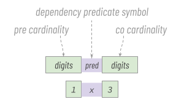

# Clarifying

__Clarifiers__ are optional, advanced annotations that can be added to a CFA. They let a content creator specify the *cardinality* of the [pre and co](concepts.md#pre-and-co) sets in the CFA, and also what kind of relationship exists between the two. Without a clarifier, a CFA might communicate: "This file is *pre* and may have *co* files". With a clarifier, it might communicate, "This file is *pre* and has exactly one *co* file that is a digital signature over the pre."

## Format
A clarifier is a three-part string. The first and third parts are cardinality numbers that quantify how many *pre* and *co* files, respectively, are known to be part of the set. For a CFA binding a spreadsheet to a digital signature, both of these numbers would be 1 &mdash; it's a 1-to-1 relationship. For a CFA binding the 4 movements of a symphony, the first number would be 4, since all 4 movements are pre. If cardinality is not known, the number is omitted. A cardinality of 0 means that no files in the set have the corresponding status; 0 is the correct value for the *pre* portion of a clarifier for a [common CFA](concepts.md#pre-and-co), since it is known to have no *pre* files. One of the two cardinality values (either the *pre* or the *co* digits, but not both) may be omitted, leaving half of the cardinality unspecified. 

The middle part of a clarifier is a __dependency predicate symbol__. Its role is somewhat like [the role of the `rel` attribute on an HTML `<link>` tag](https://www.w3schools.com/TAGS/att_a_rel.asp).

The following dependency predicate symbols are defined:

symbol | meaning | sample use cases
--- | ---| ---
a | *co* files are <u>a</u>lternative views or versions of one another | X-rays of the same broken bone produce a lateral and a top view (co files).
c | *pre* <u>c</u>ited by *co* | An academic paper (pre) and a subsequent paper that quotes from it (co). An affidavit (pre) and a legal filing that references it (co).
d | *pre* used to <u>d</u>erive *co* | A violin concerto (pre) that spawns an arrangement for clarinet (co). A novel (pre) and its audiobook version (co). A repo of source code (pre) and its forks (co).
f | *pre* <u>f</u>ollowed by (answered by, replied to by) *co* | A tweet (pre) and a reply (co). A critique (pre) and a rebuttal (co). An email (pre) and a response (co).
r | *co* <u>r</u>eviews *pre*                               | A financial statement (pre) and an auditor's report (co). An album (pre) and a review by a music critic (co).
s | *co* <u>s</u>upersedes *pre*                            | Version 1 of a formal standard (pre) and version 2 (co).
t | *co* <u>t</u>ransforms *pre* (typically in a lossy way) | A news article (pre) and translations (co). A vector graphic (pre) and a bitmap graphic (co). An audio stream (pre) and a transcription (co). A FLAC audio recording (pre) and its .mp3 compression (co). In general, transformations that are not lossy (e.g., a file in zipped and unzipped form, the same text encoded in UTF-16 and UTF-8) do not have an obvious pre-to-co directionality and are thus thought of as multi-pre (not needing clarification).
v | *co* <u>v</u>erifies *pre*                              | A spreadsheet (pre) and its digital signature (co). A downloadable software package (pre) and its hash (co). A git commit (pre) and its hash (co). A piece of malware (pre) and its distinctive profile/signature (co). A credential presentation, including nonce (pre) and its signature (co).
x | default                                               | Generic/ill-defined dependency, or multiple *co* files exist with different meanings. Separates the two cardinalities without asserting any special semantics.

## In external strategies
Clarifiers are most commonly used with the [metadata](strategies.md#metadata) and [inline content](strategies.md#inline-content) strategies, where they are the second token in an [explanation](explaining.md). However, they can also be used in external strategies. How they manifest in filenames is shown in the following table:

strategy | sample clarifier value | where to clarify | unclarified filenames | clarified filenames
--- | --- | --- | --- | ---
[sidecar](strategies.md#sidecar) | 1v1 (1 *pre* verified by 1 co) | hyphenated suffix on stem of some or all *co* and *pre* files | balance-sheet.xls, balance-sheet.xls.sig | balance-sheet-1v1.xls, balance-sheet-1v1.xls.sig
[shared stem](strategies.md#shared-stem) | x2 (2 *co* files) | hyphenated suffix on stem of some or all *co* files | IMG001-1025.heic, IMG001-1025.jpg | IMG001-1025-x2.heic, IMG001-1025-x2.jpg 
[infix](strategies.md#infix) | a2 (two views of the same thing) | unhyphenated suffix on infix | front-bumper--01.jpg, drivers-door--01.jpg | front-bumper--01a2.jpg, drivers-door--01a2.jpg 
