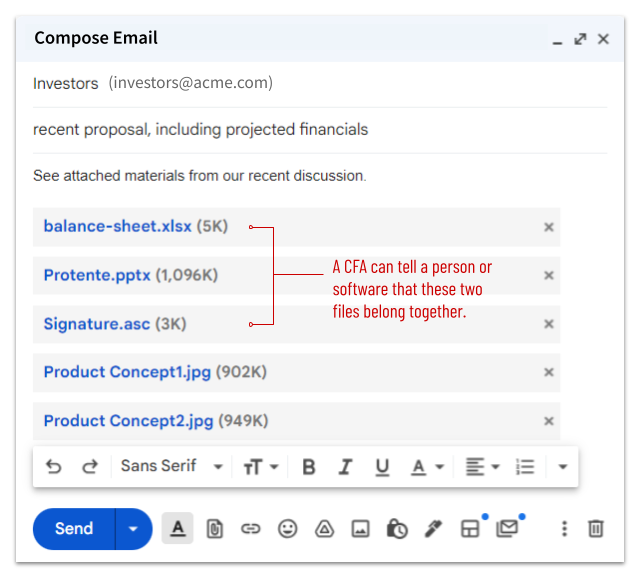
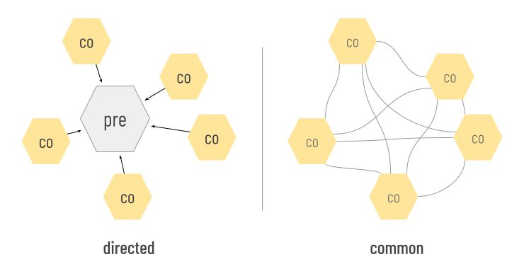

# Concepts

The theory behind CFAs is described in [an academic paper](https://docs.google.com/document/d/1rjjPIhRTlfH4kQYt0t8LBuamAXn63VQHUpUqvdMSGUY/edit). There's also a [Dev Guide](dev-guide.md). We'll skip most of the details in this tutorial, but we still need to define a few terms.

## Example
Consider an email that includes as attachments a slide deck, photos, a spreadsheet, and a digital signature. A CFA can make it obvious that the digital signature is bound to the spreadsheet. Noticing the CFA, email clients can encourage uploading or downloading the two associated files as a unit, and warn if they become separated.

## Building blocks
In the context of CFAs, a __file__ is anything that has a name/identifier and content &mdash; the familiar artifact in a file system, but also a web page, a tweet, a piece of data, etc. A __container__ is anything that holds files: a folder, an email, a database, an S3 bucket, and so forth. These two object categories are not mutually exclusive; files can be containers (e.g., zip files), and containers can be thought of as files (e.g., emails saved as .eml).

When a file participates in a cross-file association, we say that the file __binds__ the CFA. A given file may bind zero or more CFAs.

## pre and co

Some CFAs impute special status to a subset of its bound files that *come before* the others. We call these __directed__ CFAs. The precedence of these files may or may not mean they are more valuable &mdash; importance and utility are contextual &mdash; but such files are almost always created *first*, and they provide a *logical foundation* toward which the group is oriented and upon which the meaning of the overall group depends. Such files are called __pre files__.

If the same audio recording is saved in both .flac and .mp3 format, the two files might be bound into a CFA that is directed toward the *pre* FLAC version (which is lossless), with the lossy MP3 as a *co* file.

A __common CFA__ is not directed toward *pre*; it models a simple set in which all bound files are *co* files with one another.

A given file may have *pre* status in one CFA, and *co* status in another. 

Sometimes, co files are created by different authors than the pre file they depend on. A student who writes an essay explicating a poem is creating a co file that depends on the poem as a pre file. This could happen long after the poet is dead, and without the poet's active cooperation. Thus, co files may know more about pre files than vice versa.

## External vs. internal strategies

There are various ways to declare a CFA. We call them __strategies__. [Different strategies](strategies.md) have different pros and cons.

When the strategy that binds a file to a CFA requires changes to the content of the file, we say that the strategy is __internal__, or that the file is __internally bound__ to that CFA. When the binding convention manifests outside the content of the file, we say that the strategy is __external__, or that the file is __externally bound__. External and internal strategies are not mutually exclusive; a given file may use both to bind CFAs.

