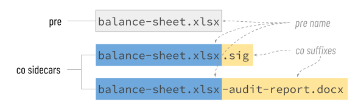
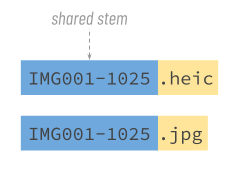
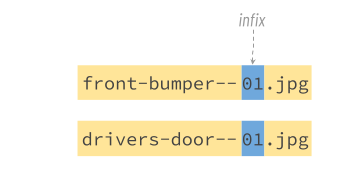
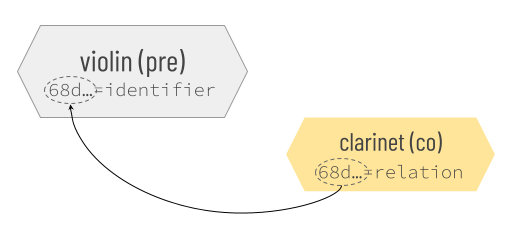
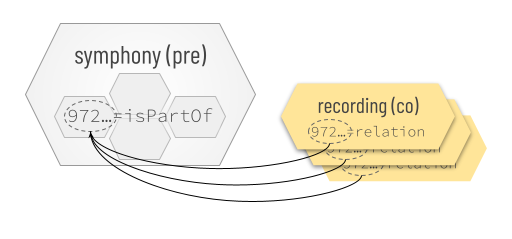
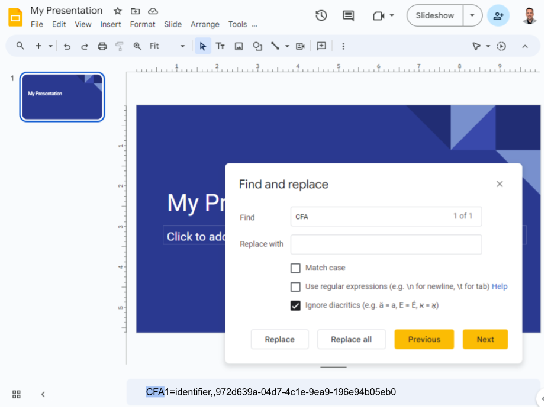

# Strategies

Several strategies for declaring a CFA are standardized.

## Sidecar

One simple strategy is to name files in a way that embodies the __sidecar__ naming pattern. In this strategy, there is one pre file in the CFA, and it has any arbitrary name. Any co files are called "sidecars" because their names are dependent on the pre: a sidecar name equals the name of the pre file followed by a unique, descriptive suffix.

Referencing the [spreadsheet-digital-signature-in-email example](concepts.md#example) that's mentioned in the conceptual overview, if the spreadsheet attachment is named `balance-sheet.xlsx`, and the digital signature attachment is named `balance-sheet.xlsx.sig`, an email client can know that a sidecar CFA is active; the spreadsheet is the pre file, and the digital signature is co.

Sidecar CFAs are not always pairwise. We could add a third file in the same container and name it `balance-sheet.xlsx-audit-report.docx`; this would be an additional sidecar bound to the same CFA.

In sidecar names, the boundary between the pre name and the unique sidecar suffix must be delimited by one or more non-word characters such as a space, `.`, `-`, or `_`.

Sidecar CFAs are *directional* and *external*. Like all external strategies, they are also container-dependent; the relationship implied by the naming convention cannot be evaluated except within the context of a shared container.

Sidecar naming is easy and intuitive. In fact, this strategy is already used by many individuals and software packages; they are making CFAs even if they don't describe it in these terms. However, sidecars are not as powerful as some other strategies. They can be extended somewhat with [clarifiers](clarifying.md).

## Shared stem

A variation on sidecars is to associate files by giving their name a common __stem__, varying only at the end. The stem of a filename is the portion before the first `.` character. Digital cameras and related software often uses this strategy &mdash; saving `.raw` + `.tiff` or `.heic` + `.jpg` versions of each photo as associated pairs.

Although shared stems resemble sidecars in some ways, their semantics are different. Shared stem CFAs are *common*; within the files that share a stem, there is no notion of dependency. This makes them an awkward fit for the spreadsheet-digital-signature-in-email example we used above. Naming the spreadsheet `balance-sheet.xlsx` and the signature `balance-sheet.sig` *does* connect them, but it does not convey the idea that the signature is meaningless without the spreadsheet.

Like sidecars, shared stems are easy and intuitive, but their expressiveness is limited. They can be extended somewhat with [clarifiers](clarifying.md).

## Infix

Another simple and external CFA convention is the __infix__ pattern. In this pattern, files that bind the same CFA share a common 1-to-3-digit infix in their names. The infix cannot begin a name. It must be preceded by two hyphens and followed by a non-word character.

Suppose a police photographer is documenting an accident that involved several vehicles, and each will be photographed from multiple angles and lighting conditions. They might associate photos of vehicle 1 using a common infix: `front-bumper--01.jpg` and `drivers-door--01.jpg`, respectively.

Infixes are compared numerically, not textually; this means an infix of `01` and an infix of `1` are equivalent.

A file may bind more than one infix in its name: `tangled-bumpers--1--3.jpg` is a member of CFAs using both the `1` and `3` infixes, and might show both vehicles 1 and 3 in our example.

Normally, infix CFAs are *common*. They can be extended somewhat with [clarifiers](clarifying.md).

## Metadata
Many popular file formats support arbitrary metadata. HTML allows &lt;meta&gt; tags; markdown has [YAML frontmatter](https://docs.github.com/en/contributing/writing-for-github-docs/using-yaml-frontmatter); PDFs and most Adobe file formats support [XMP metadata](https://en.wikipedia.org/wiki/Extensible_Metadata_Platform); Microsoft Office formats support keyword tagging. Such files can bind CFAs internally, by declaring one or more special <var>name</var>, <var>value</var> metadata pairs in a form that we could describe with the symbolic notation `CFAn=explanation`.

>Note: In this notation `CFAn` is a placeholder for a string where `n` is any convenient sequence of one or more digits that's unique in a given file, and `explanation` is a placeholder for some special descriptive syntax. The equals sign represents whatever mapping mechanism the metadata format uses to associate a name with a value. For metadata schemes that require a URL to define the CFA namespace, the URL to use is: https://purl.archive.org/purl/cfa.

Using metadata to bind CFAs is more expressive but also more complex than external strategies.

Each CFA metadata pair conveys the idea, "This file binds a CFA with internal index `n`, and its type, meaning, and formal external identifier can be found in `explanation`." Files that have CFA metadata sharing the same identifier in the `explanation` (regardless of whether they index it with the same internal number `n`) bind the same CFA and are thus part of the same set. For more information, see [Explaining CFAs](explaining.md).

Importantly, files bound to a CFA via metadata can be part of the same set *whether or not they are in the same container, and whether or not they are owned or controlled by the same party*. This can solve certain centralization problems.

### Simple co

Suppose that Alice, a composer of classical music, wants to mark all her compositions as belonging to the overall corpus of compositions that she creates during her career. Alice can embed metadata in each new digital file that she authors, marking it internally as part of a CFA identified by the UUID for her corpus:

    CFA1=relation,,0bbfac55-81c9-48ab-8934-9a46c64c0703
    
That UUID, `0bb...`, will bind all her creative output together, even if it's built with a variety of tools, for many clients, across decades, and stored in a hodge-podge of storage containers. 

### Pre and co

Building on this example, suppose that Alice writes a piece of music for the violin. Later, she arranges a derivative version for the clarinet. Since these two pieces of music are part of her overall corpus, they have a cross-file association to her corpus and should bind the CFA shown above. In addition, these two pieces of music have a more specific relation to one another. The clarinet version is co &mdash; dependent upon the original violin composition &mdash; which is pre. In such a case, and assuming the composer chooses arbitrary identifier `68d15148-a0bd-4716-9618-061a17389689` for the CFA between this pair of files, she might embed more metadata in her pre violin composition that says:

    CFA2=identifier,,68d15148-a0bd-4716-9618-061a17389689

This says her violin file binds another CFA (apparently, the 2nd one for the file) identified by the UUID at the end of the expression. The nature of the relationship between the violin file and the CFA is "identifier" &mdash; meaning that the set as a whole is *identified with* its one and only pre file. In other words, the violin file serves as a nucleus for a larger set directed at the violin file. She could then embed metadata in her co clarinet arrangement that says:

    CFA7=relation,1d,68d15148-a0bd-4716-9618-061a17389689 

This says that her clarinet file binds a CFA (apprently, the 7th one for the file) identified by the UUID at the end of the expression. The nature of the relationship between the clarinet file and the CFA is "relation" &mdash; meaning that the clarinet just relates as a co file. Since the CFA in both of these metadata pairs is the same, the binding is to the same set. The clarinet co file is thus directed to the violin pre file. The `1d` token is an optional [clarifier](clarifying.md) that says the co derives from pre, and that there is only 1 pre file in the CFA.

### Multipart pre

Now suppose that Alice writes a symphony that has 4 movements, and each movement is a separate digital file emitted by her composition software. Since each file is part of her corpus, each should bind our first CFA. It should also binds a CFA for her symphony as a multi-file work. She picks a new arbitrary identifier `972d639a-04d7-4c1e-9ea9-196e94b05eb0` for that CFA, and embeds more metadata in each movement's digital file:

    CFA2=isPartOf,4x,972d639a-04d7-4c1e-9ea9-196e94b05eb0

This binds the file for each movement to a directional CFA, where the nature of the relationship between the file and the CFA is "isPartOf". In other words, each movement is part of an aggregate pre. We know it is not co, because the nature was not declared to be "relation". We also know that there are 4 parts, due to the `4x` [clarifier](clarifying.md).

### Multipart pre with co

The possibility of co is still useful with this symphony CFA. If three recordings of this symphony are performed, the composer can mark each recordings as co, dependent on the multi-part pre: 

This might be done with metadata like this:

    CFA1=relation,4t,972d639a-04d7-4c1e-9ea9-196e94b05eb0

Here, the `4t` clarifier tells us that the 4-part pre has been transformed by the current file, without making any claims about how many other transformations might exist. For more about this advanced notation, see [Clarifying CFAs](clarifying.md).

## Inline content

The final CFA strategy that we'll cover here is to embed a __CFA statement__ directly into the searchable content of a file. A CFA statement is literal string in `CFAn=explanation` format, and expresses the same information as metadata would. Files that have no native metadata support, like text files or the body of an email, can use this strategy. The requirement that such CFAs be part of searchable content guarantees that a simple scan with features native to the format can find them.

For example, if I wanted to bind a Google Slides presentation to a CFA, I could add a CFA statement to the speaker notes on the first slide, and find it again with a simple search:

In some cases, CFA statements might create visual clutter that's undesirable. They could be placed in a document header or footer, and hidden by customizing the text color.

### Inline content in containers

An important use for this strategy is to apply it to a [container](concepts.md#building-blocks) (folder, zip file, email), so that the container itself can bind CFAs and possibly function as a pre file. Since the content of a container is files, adding "inline" content to the container means adding a file to it. By convention, inline CFA content in containers must be in a file named `.cfas`. This file must be plain text and must consist of one or more CFA statements, one per line. Any lines that don't match the CFA statement syntax are treated as comments.

